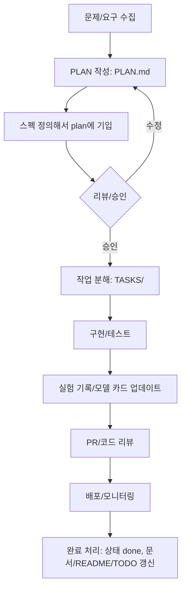

# Agent.md — 개발 운영 문서

모든 코딩 작업은 PLAN 단위로 명세를 작성하고, 해당 PLAN을 **여러 개의 TASK**로 나누어 수행합니다. 각 TASK 폴더에는 **README.md**와 **TODO.md**를 반드시 유지합니다.
각 TASK 를 진행한 뒤 TASK 폴더의 **README.md**와 **TODO.md**를 반드시 갱신합니다.
---

## 0) 용어 정리

- **plan**: 하나의 작업 단위(기능/실험/개선). 계획과 범위가 정의됨. 하나의 PLAN은 여러 **task**를 가질 수 있음.
- **task**: PLAN을 완수하기 위해 수행하는 작은 기능/활동 묶음. 구현, 테스트, 문서화 등 세분화된 실행 단위.

---

## 1) 저장소 구조(권장)

```
프로젝트 REPO/
├─ Agent.md                  # 본 문서
├─ README.md                 # 저장소 개요(상시 업데이트)
├─ TODO.md                   # 저장소 전반 Backlog(상시 업데이트)
├─ .env                      # 사용자 설정 (계정, API 키)
├─ PLAN/
│  └─ PLAN-YYYYMMDD-<slug>/
│     ├─ PLAN.md            # 해당 PLAN의 목적/범위/가설/지표/일정/리스크
│     └─ TASKS/
│        ├─ TSK-0001-<slug>/
│        │  ├─ README.md    # 작업 설명/산출물/테스트/사용방법
│        │  └─ TODO.md      # 할 일, 우선순위, 상태
│        └─ TSK-0002-<slug>/
│           ├─ README.md
│           └─ TODO.md
├─ src/
│  └─ name/
│     └─ data/              # 지식 엔진 데이터 (JSON)

```

---

## 2) 명명 규칙 & 메타데이터

- **PLAN ID**: `PLAN-YYYYMMDD-<slug>` (예: `PLAN-20251021-web-service-view`)
- **TASK ID**: `TSK-<4digit>-<slug>` (예: `TSK-0003-build-feature-store`)
- 문서 상단에는 **YAML Front Matter**로 메타데이터를 유지합니다.

### `.sisyphus/plans` 파일명 규칙(강제)

- `.sisyphus/plans` 하위 PLAN 문서 파일명은 반드시 `PLAN-YYYYMMDD-<slug>.md` 형식을 사용합니다.
- Prometheus(또는 plan 작성 에이전트)는 PLAN 생성 시 본 규칙을 먼저 확인하고, 규칙에 맞는 파일명으로만 생성/갱신합니다.
- 규칙을 벗어난 파일명(slug-only 등)으로는 신규 PLAN을 만들지 않습니다.

### 공통 메타(Front Matter)

```yaml
---
id: PLAN-20251021-UIUX개선
title: UIUX 개선
status: draft # draft|review|ready|doing|blocked|done|archived
priority: P1   # P0|P1|P2|P3
created_at: 2025-10-21
updated_at: 2025-10-21
related:
  plan: []
  tasks: [TSK-0001-..., TSK-0002-...]
tags: [forecast, baseline, retail]
---
```

> **상태 정의**
>
> - `draft`: 기획/초안 단계
> - `review`: 리뷰 중(범위/가설/지표/스펙 검증)
> - `ready`: 실행 준비 완료(리소스/데이터 승인, 착수 가능)
> - `doing`: 구현/실행 중
> - `blocked`: 외부 의존/이슈로 정지
> - `done`: 완료(검증/문서/릴리즈 포함)
> - `archived`: 보관(재사용/참고용)

---

## 3) 운영 원칙

1. **모든 코딩 작업은 PLAN 기준**으로 시작한다.
2. PLAN마다 **SPEC.md**로 기술 스펙을 명시하고, 승인되면 **TASKS**로 세분화한다.
3. 각 **TASK 폴더에는 README.md, TODO.md**를 필수로 둔다.
4. 모든 작업 전/후로 **저장소 루트의 README.md와 TODO.md**도 필요한 범위에서 갱신한다.
5. 변경점은 **실험 로그**와 **모델 카드**에 반영한다.
6. PLAN 산하 문서(`PLAN.md`, `SPEC.md`, `TASKS/*/README.md`, `TASKS/*/TODO.md`)는 **모두 한글로 작성**한다. (코드, 경로, 식별자 등은 예외)
7. `.sisyphus/plans`의 PLAN 파일은 항상 `PLAN-YYYYMMDD-<slug>.md` 네이밍 규칙을 준수한다.
8. <slug>는 한글로 작성한다.
9. **각 TASK 완료 직후 반드시 커밋한다.** 커밋 메시지는 TASK ID를 포함한다. (예: `feat(TSK-0002): openapi 및 ddl 초안 추가`)

---

## 4) 프로세스 플로우



---

## 5) 템플릿 모음

### 5.1 PLAN 템플릿 (`PLAN/PLAN-YYYYMMDD-<slug>/PLAN.md`)

```markdown
---
id: PLAN-YYYYMMDD-<slug>
title: <PLAN 제목>
status: draft
priority: P1
created_at: YYYY-MM-DD
updated_at: YYYY-MM-DD
related:
  tasks: []
tags: [forecast]
---

## 1. 배경/문제 정의
- 비즈니스 맥락:
- 현재 성능/운영 이슈:

## 2. 목표/가설
- 1차 지표(Primary): <예: WMAPE, sMAPE, RMSE>
- 2차 지표(Secondary): <예: Latency, Cost>
- 가설: <예: 휴일/프로모션 특성 추가 시 WMAPE 3%p 개선>

## 3. 범위/산출물(Scope & Deliverables)
- 포함/제외 범위:
- 산출물(코드/모델/대시보드/문서):

## 4. 일정/마일스톤
- M1(스펙 확정): YYYY-MM-DD
- M2(베이스라인 학습): YYYY-MM-DD
- M3(오프라인 검증): YYYY-MM-DD
- M4(배포/AB테스트): YYYY-MM-DD

## 5. 리스크 & 가정
- 데이터 품질/지연/누락:
- 시스템/리소스 제약:
- 보안/개인정보:

## 6. 검증/수용 기준(DoD)
- [ ] 지표 개선 ≥ X% (기준 대비)
- [ ] 모델 카드/실험 로그 최신화
- [ ] README/TODO 갱신 및 PR 병합

## 7. 변경 이력
- YYYY-MM-DD: <변경 요약>
```

```

### 5.2 TASK 템플릿 (`PLAN/.../TASKS/TSK-XXXX-<slug>/README.md`)

```markdown
---
id: TSK-0001-<slug>
plan_id: PLAN-YYYYMMDD-<slug>
owner: <담당자>
status: ready # ready|doing|blocked|done
estimate: <예: 1d>
updated_at: YYYY-MM-DD
---

## 목적
해당 TASK가 해결할 구체 문제/산출물.

## 작업 내역
- [ ] 항목 1
- [ ] 항목 2

## 산출물(Artifacts)
- 코드/스크립트 경로:
- 모델/파일:
- 문서/노트북:

## 테스트/검증
- 테스트 방법/데이터/성공 기준

## 의존성/리스크
- 선행 TASK/시스템/권한

## 완료 기준(DoD)
- [ ] 유닛/통합 테스트 통과
- [ ] 코드 리뷰 승인/병합
- [ ] TASK 완료 직후 커밋 완료 (커밋 메시지에 TASK ID 포함)
- [ ] README/TODO/실험 로그/모델 카드 갱신
```

### 5.3 TASK용 TODO 템플릿 (`PLAN/.../TASKS/TSK-XXXX-.../TODO.md`)

```markdown
# TODO — TSK-0001-<slug>

## Now
- [ ]

## Next
- [ ]

## Later
- [ ]

## Blocked
- [ ] (<원인>, <해결 방안>, <ETA>)
```

### 5.5 저장소 루트 README/TODO 가이드

- **README.md**: 프로젝트 개요, 설치/실행, 데이터 위치, 실험/배포 방법, 모델 레지스트리/아티팩트 링크, 폴더 구조, 연락처.
- **TODO.md**: 저장소 레벨 백로그(이슈/아이디어), Now/Next/Later 칼럼, 각 항목에 PLAN/TASK ID 태깅.


---

## 6) 커밋 컨벤션(규칙)

- `feat(TSK-0001): ...`
- `fix(TSK-0004): ...`
- `docs(PLAN-20251021): ...`

---

## 7) 예시 시나리오

1. `PLAN-20251021-demand-forecast-baseline` 생성 → `PLAN.md`/`SPEC.md` 작성.
2. TASK 분해: `TSK-0001-data-quality`, `TSK-0002-build-features`, `TSK-0003-train-baseline`.
3. 각 TASK 폴더에 `README.md`/`TODO.md` 생성 및 진행.
4. PR 시 PLAN/TASK ID 명시, 머지 후 루트 README/TODO 업데이트.

---
